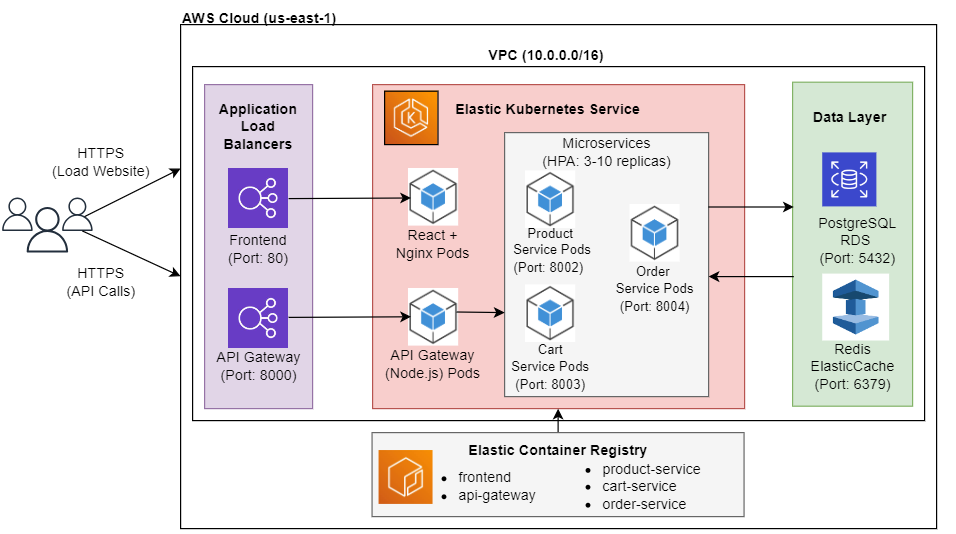
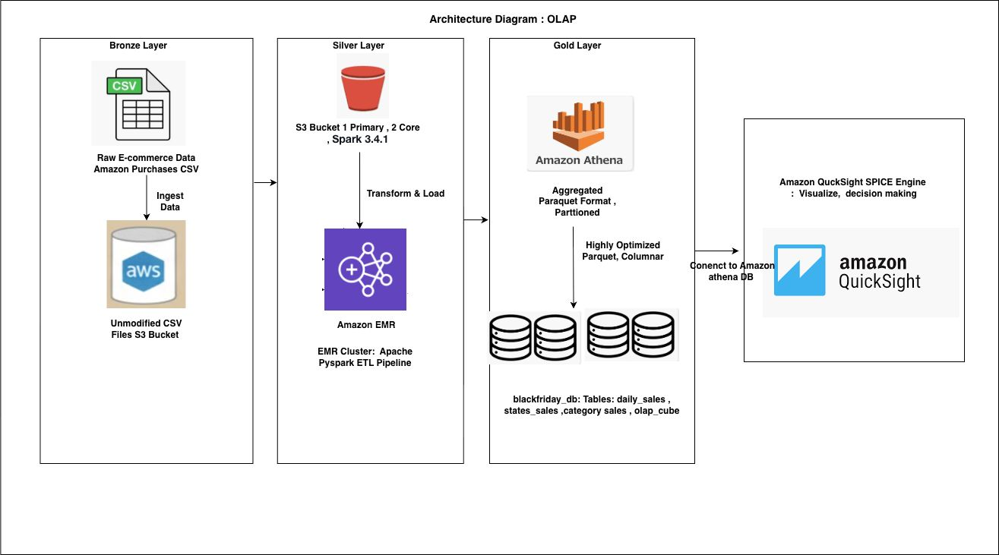
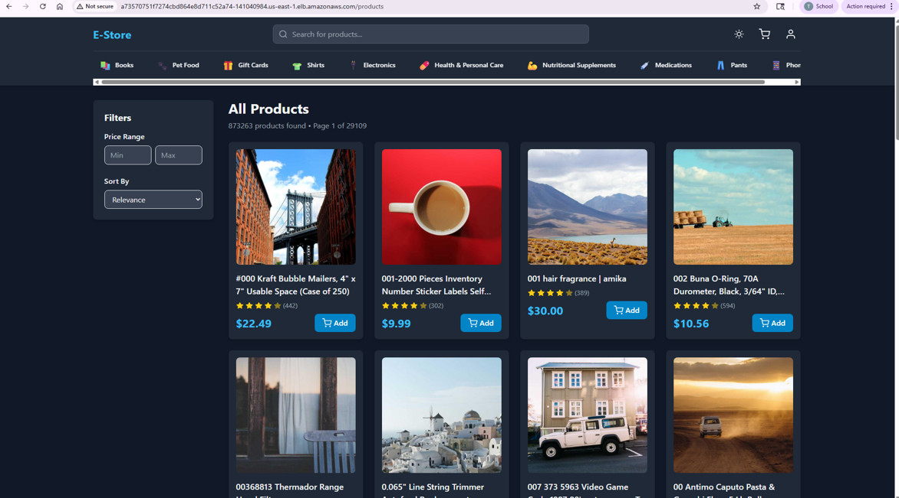
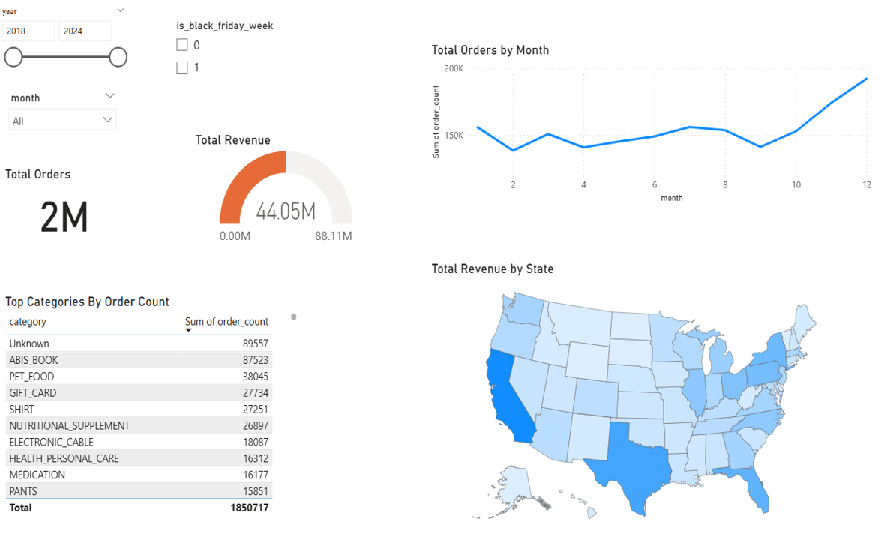

# Full-Stack E-Commerce Platform: Black Friday Sales Analytics

**Cloud-Native Data System with OLTP/OLAP Architecture on AWS**

[](https://aws.amazon.com/)
[](https://kubernetes.io/)
[](https://spark.apache.org/)
[](https://reactjs.org/)

## 📊 Project Overview

This project implements a production-grade e-commerce data platform addressing **Big Data's 3 Vs**:
- **Volume**: 1.8M+ transactions processed via distributed computing
- **Velocity**: 637.7 req/s throughput with auto-scaling (3→10 pods)
- **Variety**: OLTP transactions, OLAP analytics, real-time caching

### Architecture Highlights
- **OLTP**: Kubernetes-orchestrated microservices with horizontal autoscaling
- **OLAP**: AWS EMR (PySpark) + Athena + Power BI for historical analytics
- **Incremental ETL**: Lambda-inspired batch sync (PostgreSQL → S3 data lake)

---

## 🏗️ System Architecture

### OLTP Architecture (Real-Time Transaction Processing)



*Microservices architecture with Kubernetes horizontal pod autoscaling, Redis caching, and PostgreSQL persistence*

### OLAP Architecture (Historical Analytics)



*Distributed data processing pipeline: PySpark on EMR → S3 Parquet → Athena → Power BI*

---

## 🚀 Key Results

### OLTP Performance
| Metric | Value | Notes |
|--------|-------|-------|
| **Peak Throughput** | 637.7 req/s | 500 concurrent users |
| **Response Time** | 102-138 ms | <1% errors up to 250 users |
| **Auto-Scaling** | 3→10 pods | 142% performance improvement |
| **Cache Hit Rate** | 95%+ | Redis 5ms vs 150ms database |

### OLAP Analytics
| Metric | Value | Notes |
|--------|-------|-------|
| **Dataset Size** | 1.8M transactions | 2018-2022 (5 years) |
| **Processing Time** | 2-3 minutes | vs. 30-45 min sequential |
| **Query Latency** | <1 second | Athena on partitioned Parquet |
| **Compression Ratio** | 87% | 250 MB → 31.9 MB |

### Black Friday Insights
- **36% surge** in daily orders during Black Friday week
- **25-39%** of November revenue in just 23% of days
- Peak: **3,011 orders** on Nov 25, 2022

---

## 🖥️ Application Screenshots

### React Frontend UI



*Responsive e-commerce interface with 873,263 products, server-side pagination, and sub-200ms page load times*

### Power BI Analytics Dashboard



*Interactive dashboard showing 2M+ orders, $44.05M revenue, temporal trends, and geographic distribution with sub-second query performance*

---

## 🛠️ Technology Stack

### Infrastructure
- **Cloud**: AWS (EKS, RDS, EMR, S3, Athena, ElastiCache)
- **Orchestration**: Kubernetes 1.34, eksctl
- **Compute**: EC2 t3.small (K8s), m5.xlarge (EMR)

### OLTP Services
- **Frontend**: React 18, Vite, TailwindCSS, Nginx
- **Backend**: Node.js 18, Express
- **Database**: PostgreSQL (RDS db.t3.micro)
- **Cache**: Redis (ElastiCache cache.t3.micro)
- **Load Balancer**: AWS Application Load Balancer (ALB)

### OLAP Pipeline
- **Processing**: Apache Spark 3.5.0 (PySpark)
- **Storage**: Amazon S3 (Parquet columnar format)
- **Query Engine**: Amazon Athena (serverless SQL)
- **Visualization**: Microsoft Power BI Desktop

### DevOps
- **Testing**: Apache JMeter 5.6.3
- **Monitoring**: Kubernetes Lens Dashboard, kubectl
- **CI/CD**: Docker multi-stage builds, Amazon ECR

---

## 📁 Repository Structure
```
Full_Stack_Ecommerce_Black_Friday_Sales_Project/
│
├── README.md                                              
├── backend/                           # Node.js + Express microservices
│   ├── api-gateway/                   # Routing, CORS, entry point
│   ├── product-service/               # Product catalog 
│   ├── cart-service/                  # Shopping cart 
│   └── order-service/                 # Order processing (PostgreSQL)
│       └── [Each: src/server.js, Dockerfile, package.json]
├── frontend/                          # React + Vite + TailwindCSS
│   ├── src/
│   │   ├── components/               
│   │   ├── pages/                    
│   │   └── services/                 
│   └── [Dockerfile, nginx.conf, vite.config.js, tailwind.config.js]
├── database/                         # SQL scripts
│   ├── create-table.sql              # Schema definitions
│   ├── seed-products-docker.sh       # Data seeding
│   ├── init-all-databases.sh         # Setup script
│   └── athena-update-partitions.sql  # OLAP partitions
├── emr/                               # Spark analytics (OLAP)
│   ├── scripts/
│   │   ├── black-friday-analysis.py  # Main analytics (1.8M+ records)
│   │   └── incremental-orders-etl.py # Incremental ETL
│   └── emr-pipeline.sh               # Orchestration
├── kubernetes/                        # K8s deployments
│   └── deployments/
│       ├── k8s-deployments.yaml      # Services + HPA
│       ├── build-and-push-images.sh  # Docker automation
│       └── deploy-to-kubernetes.sh   # EKS deployment
└── loadtest/                          # JMeter testing
    ├── load-test-results/            # Performance results
    └── monitor-load.sh               # Monitoring
```

---

## ⚙️ Setup Instructions

### Prerequisites
- AWS Account (Free Tier eligible)
- AWS CLI configured with credentials
- kubectl, eksctl installed
- Docker Desktop running
- Apache JMeter (for load testing)

### 1. Deploy Infrastructure
```bash
# Clone repository
git clone https://github.com/theyaneshj17/Full_Stack_Ecommerce_Black_Friday_Sales_Project.git
cd Full_Stack_Ecommerce_Black_Friday_Sales_Project

# Create EKS cluster (takes ~15 minutes)
eksctl create cluster \
  --name ecommerce-cluster \
  --region us-east-1 \
  --nodegroup-name standard-workers \
  --node-type t3.small \
  --nodes 2 \
  --nodes-min 2 \
  --nodes-max 10

# Create RDS PostgreSQL instance
aws rds create-db-instance \
  --db-instance-identifier ecommerce-postgres \
  --db-instance-class db.t3.micro \
  --engine postgres \
  --master-username postgres \
  --master-user-password YOUR_PASSWORD \
  --allocated-storage 20 \
  --vpc-security-group-ids YOUR_SG_ID \
  --db-subnet-group-name YOUR_SUBNET_GROUP

# Create ElastiCache Redis
aws elasticache create-replication-group \
  --replication-group-id ecommerce-redis \
  --replication-group-description "Redis for e-commerce" \
  --engine redis \
  --cache-node-type cache.t3.micro \
  --num-cache-clusters 1
```

### 2. Seed Database
```bash
cd database/
./init-all-databases.sh           # Create schemas
./seed-products-docker.sh          # Load 873,263 products
```

### 3. Build and Deploy OLTP Services
```bash
cd kubernetes/deployments/

# Build Docker images and push to ECR
./build-and-push-images.sh

# Deploy to Kubernetes
./deploy-to-kubernetes.sh

# Verify deployment
kubectl get pods
kubectl get hpa
```

### 4. Deploy OLAP Pipeline
```bash
cd emr/

# Launch EMR cluster and submit Spark job
./emr-pipeline.sh

# Monitor job progress
aws emr list-steps --cluster-id j-XXXXX --region us-east-1
```

### 5. Configure Athena
```bash
# Create external tables
cd database/
# Run athena-update-partitions.sql in AWS Athena console

# Query example
SELECT year, month, SUM(revenue) as total_revenue
FROM daily_sales
WHERE is_black_friday_week = 1
GROUP BY year, month
ORDER BY year, month;
```

### 6. Run Load Tests
```bash
cd loadtest/

# Monitor system during load test
./monitor-load.sh &

# Run JMeter test (simulates 500 concurrent users)
jmeter -n -t black-friday-test.jmx -l results.jtl

# View results
jmeter -g results.jtl -o report/
```

---

## 📈 Performance Benchmarks

### Load Testing Results

| Test | Users | Requests | Avg Response | Throughput | Errors | Pods |
|------|-------|----------|--------------|------------|--------|------|
| 1 | 1 | 100 | 102 ms | 9.8/s | 0% | 3 |
| 2 | 10 | 1,000 | 102 ms | 51.8/s | 0% | 3 |
| 3 | 100 | 10,000 | 107 ms | 245.2/s | 0% | 6 ↑ |
| 4 | 250 | 25,000 | 138 ms | 593.6/s | 0.6% | 8 ↑ |
| 5 | 500 | 50,000 | 429 ms | 637.7/s | 50.5% | 10 ↑ |

**Key Findings:**
- System maintains <1% errors up to **593.6 req/s** (250 users)
- Kubernetes HPA successfully scales from 3 → 10 pods
- Single RDS instance becomes bottleneck at 500+ concurrent users

---

## 🎯 Key Features

### OLTP Features
✅ Horizontal pod autoscaling (3-10 replicas based on CPU)  
✅ Redis caching (1-hour TTL products, 5-min categories, 24-hour carts)  
✅ Connection pooling (7 connections/pod, 70 total)  
✅ Sub-150ms response times under normal load  
✅ Zero-downtime rolling deployments  

### OLAP Features
✅ Distributed processing (2-3 min vs. 30-45 min sequential)  
✅ Columnar Parquet storage (87% compression)  
✅ Year-month partitioning for fast queries  
✅ Sub-second Athena query performance  
✅ Incremental ETL with checkpoint-based watermarking  

---

## 🐛 Common Issues & Solutions

### Issue: Pods can't connect to RDS
**Solution:** Check security group ingress rules allow traffic from EKS cluster SG on port 5432

### Issue: Athena returns zero results after Spark job
**Solution:** Run `MSCK REPAIR TABLE table_name` to sync Glue catalog with S3 partitions

### Issue: Power BI can't connect to Athena
**Solution:** Install Simba Athena ODBC driver and configure System DSN with AWS credentials

### Issue: High error rate during load testing
**Solution:** Tune connection pool size and enable infinite timeouts in PostgreSQL pool config

---

## 📚 Documentation

- [AWS EKS Setup Guide](https://docs.aws.amazon.com/eks/latest/userguide/getting-started.html)
- [Apache Spark on EMR](https://docs.aws.amazon.com/emr/latest/ReleaseGuide/emr-spark.html)
- [Amazon Athena SQL Reference](https://docs.aws.amazon.com/athena/latest/ug/ddl-sql-reference.html)
- [Kubernetes HPA](https://kubernetes.io/docs/tasks/run-application/horizontal-pod-autoscale/)

---


## 📄 License

This project is licensed under the MIT License - see LICENSE file for details.


